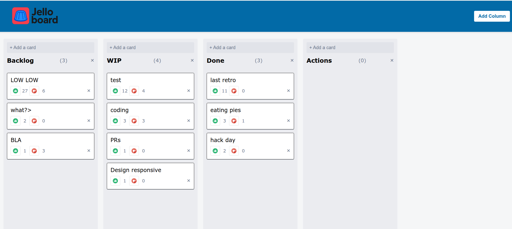

# jello

Jello: Trello-like written purely in JavaScript, it's all self-contained.

## Features

* Create, edit, and delete columns
* Create, edit, and delete cards
* Drag and drop cards between columns
* Save and load data to/from local storage
* Display card and vote count
* Up/Down vote cards
* Auto-sort cards by vote count
* Import cards from a text list

## Rationale

* Vanilla JS
* No React
* No Extermal Libraries
* No CSS Frameworks
* No build tools required
* Minimalist